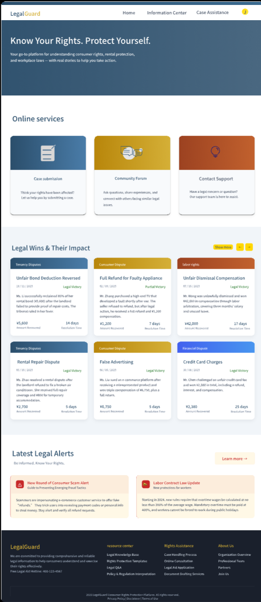
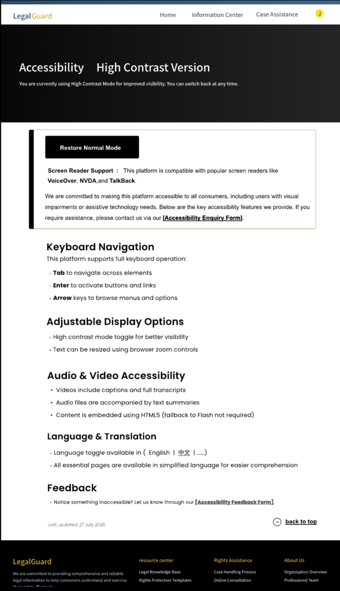

# Consumer Rights Protection Platform – Final Prototype

This repository presents the **final interactive prototype** of our *Consumer Rights Protection Platform*, designed based on **User-Centred Design (UCD)** principles to ensure accessibility, usability, and inclusivity.

## Overview

The platform aims to assist users in identifying, understanding, and resolving consumer rights issues through a combination of **community engagement**, **AI assistance**, and **legal support services**.

Developed and prototyped using **Figma** and **Pixso**, this prototype focuses on:
- Clear navigation and modular information structure  
- Seamless user journey from awareness to resolution  
- Accessibility support for visually impaired users  

## User Flow Summary

### 1. Login Page
- Users enter their **username and password** to access the platform.  
- **OTP verification** is available for password recovery.  
- Once logged in, users are directed to the homepage with a clean **navigation bar** and key feature modules:
  - Online Services  
  - Legal Wins  
  - Latest News  

### 2. Homepage & Community Forum
- The homepage introduces two main navigation menus — *Information Center* and *Case Assistance*.  
- Users can visit the **Community Forum** to browse or discuss consumer rights issues.  
- Key interactions:
  - Browse posts and detailed discussions  
  - Explore related topics from the sidebar  
  - Leave comments or share personal experiences  

> This phase supports users in realising whether their rights have been violated by engaging with community discussions.

### 3. FAQ & AI Assistant
- For quick inquiries, users can open the **FAQ Page**.  
- Common consumer issues (e.g., complaint process, refund eligibility) are listed.  
- An integrated **AI Assistant** helps users find answers instantly.

### 4. Accessibility Page
To ensure **equal access** for all users, the platform provides an accessibility-focused interface that:
- Supports major **screen readers**  
- Offers **high-contrast mode** for visually impaired users  
- Provides **language switching** options  
- Includes a **feedback form** designed to work even in high-contrast mode  

> Accessibility is treated as a core feature, not an afterthought.

### 5. Case Handling Options

#### (1) Case Submission
- Users can access the **Case Submission** page to submit complaints.
- Multiple **form templates** are provided for different scenarios.
- “Expand All” allows users to preview all templates quickly.
- Two submission options:
  - **Email Submission:** requires personal details  
  - **Direct Platform Submission:** securely handled within the system  

#### (2) Contact Support
- For urgent cases, users can locate **legal agencies** across different regions.  
- Each entry includes contact details and location info.  
- Every page includes a **Back button** for easy navigation.

### 6. News & Blogs
- Users can browse **News Updates** and **Legal Wins** under two separate tabs.  
- Each article has a detailed view and a navigation option to return to the main interface.

### 7. User Account Page
After logging in, users can manage all personal interactions within the system.

**Modules include:**
- **Viewed Posts Tracker:** history of browsed community discussions  
- **Case Tracker:** progress bar displaying current complaint status  
- **Saved Legal Topics:** manage bookmarked legal articles and posts  
- **Notification Settings:** configure reminders (email, SMS, or case updates)  
- **Account Settings:** update personal information and preferences  

## Design Philosophy

This prototype was built with three guiding principles:
1. **User-Centred Design (UCD):** Focused on real user tasks and behaviour.
2. **Accessibility:** Designed for inclusivity across all user groups.
3. **Transparency:** Provides clear and structured legal guidance.

## Tools & Technologies
- **Design & Prototyping:** Figma and pixso  
- **Principles:** UCD, Accessibility, Responsive Layouts  
- **Features:** Multi-language support, AI assistant integration concept, community interactivity

## Prototype Access
- **Prototype Link:** [View the Interactive Prototype](https://pixso.cn/app/design/qdjXgK437SfpVolAH6HMJA?page-id=0%3A1)
- **Preview SystemFlow:**  
  
- **Preview:**
  - 
  - 
  - 

## Summary

Through this user-centred, accessible, and functional design,  
our goal is to empower every user to **understand and protect their consumer rights**.

> “Design not just for function, but for fairness.”

