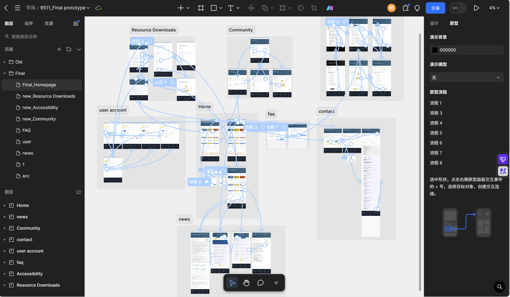
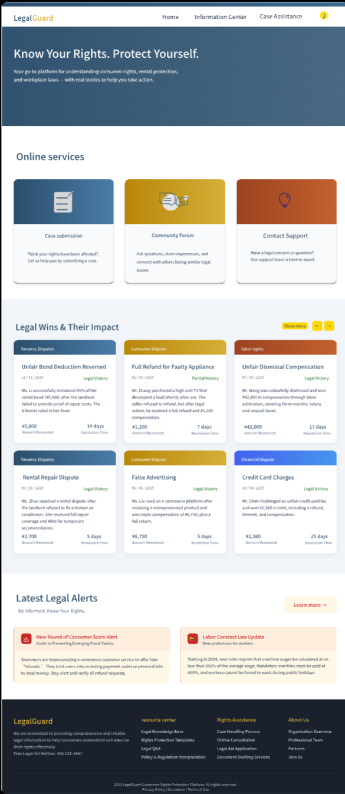
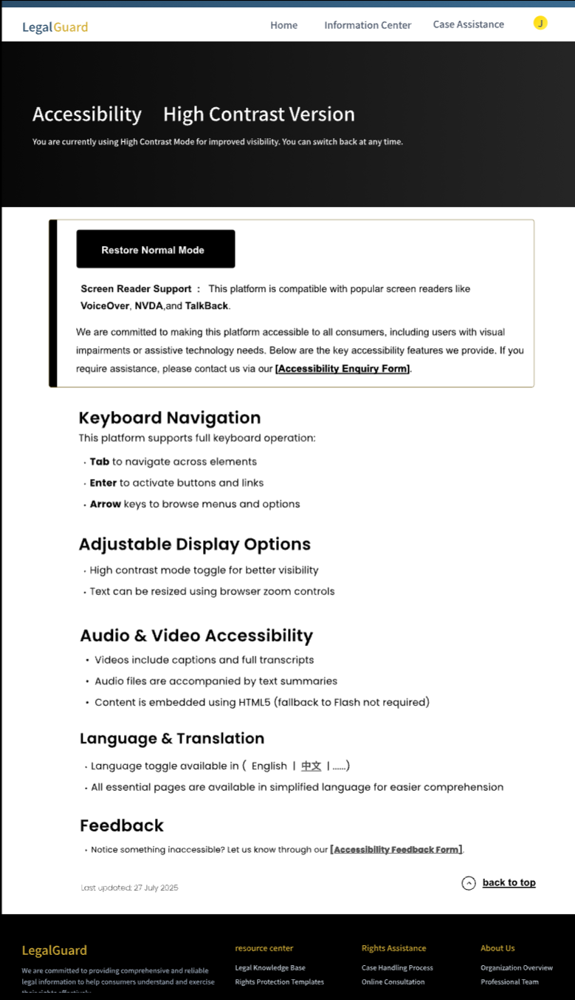

# Consumer Rights Protection Platform  (UCD & Accessibility-Focused)

## Executive Summary

An end-to-end **consumer rights assistance platform prototype** designed using **User-Centred Design (UCD)** principles, with a strong emphasis on **accessibility**, **legal transparency**, and **guided case resolution**.

This project demonstrates my ability to translate complex legal and procedural workflows into **clear, inclusive user journeys**, supporting users from issue awareness to formal case submission.

---

## Project Overview

The **Consumer Rights Protection Platform** is designed to help users identify, understand, and resolve consumer rights issues through a combination of:

- Community-driven knowledge sharing  
- AI-assisted legal guidance  
- Structured case handling and legal support access  

The prototype focuses on reducing user uncertainty, lowering cognitive load, and ensuring equal access for users with diverse needs.

**Design Goals**
- Clear navigation and modular information architecture  
- Seamless transition from awareness to action  
- Accessibility as a core system requirement, not an add-on  

---

## User Journey & System Flow

### 1. Authentication & Entry
- Secure login using username and password  
- OTP-based password recovery  
- Post-login landing on a simplified homepage with key modules:
  - Online Services  
  - Legal Wins  
  - Latest News  

---

### 2. Homepage & Community Forum (Awareness Stage)

**Purpose:** Help users determine whether their consumer rights may have been violated.

**Key Features**
- Dual navigation structure: *Information Center* and *Case Assistance*  
- Community Forum with:
  - Discussion posts and detailed threads  
  - Topic-based sidebar navigation  
  - Commenting and experience sharing  

> Community engagement is intentionally positioned before case submission to reduce unnecessary escalation and empower informed decision-making.

---

### 3. FAQ & AI Assistant (Quick Resolution)

- Centralised FAQ covering common consumer issues (refunds, complaints, eligibility)  
- Integrated **AI Assistant** concept for instant, contextual answers  
- Designed to minimise friction for users seeking immediate guidance  

---

### 4. Accessibility-First Interface

Accessibility is treated as a **first-class design constraint**, not a visual enhancement.

**Implemented Concepts**
- Compatibility with major screen readers  
- High-contrast mode for visually impaired users  
- Multi-language switching  
- Accessible feedback form is functional under high-contrast settings  

> The interface remains fully usable under assistive-technology scenarios, ensuring inclusive access to legal information.

---

### 5. Case Handling & Legal Support

#### (1) Case Submission
- Dedicated Case Submission module  
- Multiple scenario-based form templates  
- “Expand All” preview for rapid comparison  
- Two submission pathways:
  - **Email Submission:** requires user contact details  
  - **Direct Platform Submission:** securely handled within the system  

#### (2) Contact Legal Support
- Directory of legal agencies organised by region  
- Clear contact and location information  
- Consistent navigation with backtracking support  

---

### 6. News & Legal Wins

- Separate tabs for **Legal News** and **Case Success Stories**  
- Detailed article views with clear return navigation  
- Designed to reinforce trust and platform credibility  

---

### 7. User Account Dashboard

A centralised space for managing all user interactions.

**Modules Include**
- Viewed Posts Tracker  
- Case Progress Tracker with status indicators  
- Saved Legal Topics and articles  
- Notification Preferences (email, SMS, case updates)  
- Account and personal information management  

---

## Design Philosophy

This prototype is guided by three core principles:

1. **User-Centred Design (UCD)**  
   Interfaces and flows are structured around real user goals and behaviours.

2. **Accessibility & Inclusivity**  
   Equal access is prioritised across visual, cognitive, and language barriers.

3. **Transparency & Trust**  
   Legal processes are broken down into understandable, actionable steps.

---

## Tools & Methods

- **Design & Prototyping:** Figma, Pixso  
- **Methodology:** User-Centred Design (UCD)  
- **Design Focus:** Accessibility, responsive layouts, modular information architecture  
- **Feature Concepts:** AI-assisted guidance, community interaction, multi-language support  

---

## My Contribution

- Designed complete end-to-end user flows, from authentication to case resolution  
- Led accessibility-focused UI decisions, including high-contrast mode and assistive-technology support  
- Structured complex legal information into modular, task-oriented layouts  
- Built high-fidelity interactive prototypes using Figma and Pixso  

---

## Skills Demonstrated

- User-Centred Design (UCD)  
- Accessibility-First Interface Design  
- Information Architecture & User Flow Design  
- Legal-Tech Product Thinking  
- High-Fidelity Prototyping  

---

## Prototype & Previews

- **Interactive Prototype:**  
  [View the Interactive Prototype](https://pixso.cn/app/design/qdjXgK437SfpVolAH6HMJA?page-id=0%3A1)

- **System Flow Overview:**  
  

- **UI Previews:**  
  -   
  -   
  - 

---

## Summary

This project demonstrates how **inclusive, user-centred design** can transform complex legal processes into **approachable and actionable digital experiences**, empowering users to confidently protect their consumer rights.

> *Design not just for function, but for fairness.*
